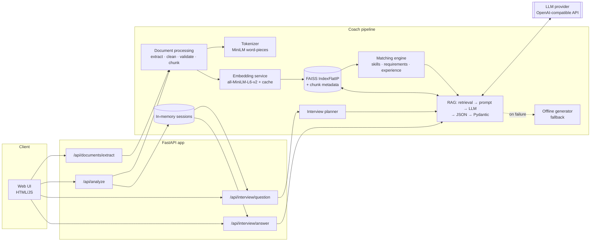
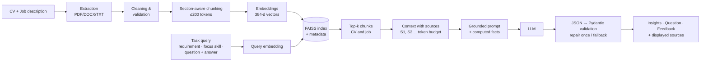

# AI Job Interview & Application Coach

> A Retrieval-Augmented Generation (RAG) application that compares a CV with a job description, explains the match with a transparent score, generates personalised interview questions and gives grounded feedback on the candidate's answers.

Final project, Generative AI Bootcamp.

---

## Table of contents

1. [Project Overview](#project-overview)
2. [Problem](#problem)
3. [Solution](#solution)
4. [Features](#features)
5. [Architecture](#architecture)
6. [How the RAG Pipeline Works](#how-the-rag-pipeline-works)
7. [Matching Methodology](#matching-methodology)
8. [Technology Stack](#technology-stack)
9. [Project Structure](#project-structure)
10. [Installation](#installation)
11. [Environment Variables](#environment-variables)
12. [Running the Application](#running-the-application)
13. [API Documentation](#api-documentation)
14. [Example Usage](#example-usage)
15. [Testing](#testing)
16. [Evaluation](#evaluation)
17. [Challenges](#challenges)
18. [Limitations](#limitations)
19. [Future Improvements](#future-improvements)
20. [Demo Instructions](#demo-instructions)
21. [Conclusion](#conclusion)

---

## Project Overview

The user uploads (or pastes) a **CV** and a **job description**. The application:

1. extracts and cleans the text (PDF, DOCX, TXT),
2. splits both documents into section-aware, token-bounded **chunks**,
3. turns every chunk into an **embedding** and indexes it with **FAISS**,
4. computes a **transparent match score** (skills, requirement coverage, semantic similarity, experience),
5. uses **semantic retrieval + an LLM** to explain the match, generate **personalised interview questions** and **evaluate answers**, always citing the CV/job passages it relied on.

It is **not** a chatbot that receives the whole CV and job ad in one prompt: every LLM call receives only the chunks retrieved by FAISS for that specific task, plus deterministic facts computed in code.

## Problem

Job seekers usually prepare for interviews with generic question lists. They do not know:

- how well their CV actually matches a given job and *why*;
- which requirements are not evidenced in their CV (the questions an interviewer is most likely to dig into);
- whether their answers are specific, structured and connected to the role.

Generic LLM chats make this worse in a subtle way: they confidently invent experience the candidate never had, or produce a "match percentage" that cannot be explained.

## Solution

A small, explainable GenAI system:

| Need | How it is solved |
|---|---|
| "How well do I match?" | Deterministic, documented score combining 4 signals; every sub-score is explained in the UI. |
| "Where is the evidence?" | Each job requirement is matched to the best CV chunk via semantic search (FAISS) and shown as evidence. |
| "What will they ask me?" | A planner picks a category (technical / experience / gap / behavioral) and a focus (a skill or requirement) from the analysis; RAG retrieves the relevant CV + job passages; the LLM writes a question grounded in them. |
| "Was my answer good?" | The answer is evaluated against a 4-criterion rubric and the retrieved context; the overall score is computed in code; the improved answer uses `[placeholders]` instead of invented facts. |
| "Can I trust it?" | Sources (`[S1]`, `[S2]`, ...) are displayed; outputs are validated JSON; results say whether they came from the LLM or the offline fallback. |

## Features

- **Document input**: PDF, DOCX (including tables) and TXT upload, or paste text. Clear errors for empty, scanned/image-only, corrupted, unsupported or oversized files.
- **Preprocessing**: Unicode normalisation, PDF artefact repair (ligatures, hyphenated line breaks), bullet normalisation, whitespace cleanup, document validation. Technical tokens such as `C++`, `C#`, `Node.js` and `5+ years` are preserved.
- **Tokenization**: chunk sizes are measured with the embedding model's own word-piece tokenizer.
- **Chunking**: section-aware (Experience, Skills, Requirements...) and token-bounded, with unit-level overlap.
- **Embeddings**: `sentence-transformers/all-MiniLM-L6-v2` (384 dimensions, local, CPU), behind a swappable interface with an LRU cache.
- **FAISS vector search**: exact cosine similarity (`IndexFlatIP`), metadata kept aligned with every vector, filtering by document type.
- **CV / job match analysis**: overall score + 4 sub-scores, matching / missing (required vs nice-to-have) / additional skills, requirement-by-requirement coverage with CV evidence, years of experience, strengths, gaps.
- **AI insights**: summary, strengths, gaps and recommendations generated by the LLM from retrieved context, with citations.
- **Interview questions**: 4 categories rotated automatically or chosen by the user; personalised with retrieved CV and job passages; no repeats within a session.
- **Answer evaluation**: rubric scores (relevance, specificity, structure, job alignment), strengths, weaknesses, missing points, suggestions, stronger example answer and a grounding note.
- **Provider-agnostic LLM layer**: any OpenAI-compatible API (OpenAI, Gemini, Groq, Ollama...) configured with environment variables.
- **Offline mode and fallback**: without an API key (or if the LLM fails) the app still works using template- and heuristic-based generation over the same retrieved context, and clearly labels those results.
- **Web UI + REST API + OpenAPI docs**, Docker image, 102 automated tests, evaluation script.

## Architecture



Design choices, in short:

- **One process, one command.** FastAPI serves both the JSON API and the static UI. No database: each analysis creates an in-memory session holding the FAISS index, so the interview reuses it instead of re-embedding the documents (sessions expire after 2 h, at most 100 are kept).
- **Deterministic where possible, LLM where useful.** Scores, skills, requirement coverage and question planning are computed in code (reproducible, testable). The LLM writes language: explanations, questions and feedback.
- **Everything swappable through interfaces**: `EmbeddingService`, `TokenCounter`, `LLMProvider`. Tests inject fakes through the same seams.

## How the RAG Pipeline Works



### 1. Extraction and cleaning (`app/document_processing/`)

`extractors.py` reads PDF (`pypdf`), DOCX (`python-docx`, paragraphs **and tables**) and TXT (UTF-8 → cp1252 → latin-1). Magic bytes are checked first, so a renamed file produces a clear message instead of a parser stack trace. A PDF without a text layer (a scanned CV) is rejected explicitly instead of silently producing an empty analysis.

`cleaner.py` removes *formatting noise* but never *content*: no lower-casing, stop-word removal or stemming, because `C++`, `C#`, `Node.js`, `M.Sc.` or `5+ years` carry meaning. `validate_document` rejects documents that are empty, too short (< 80 chars), too long (> 60,000 chars) or mostly non-letters (broken extraction).

### 2. Tokenization and chunking (`tokenizer.py`, `chunker.py`)

Transformers read **tokens**, not characters. `all-MiniLM-L6-v2` has a hard **256-token** window and silently truncates longer input, so a long chunk would be embedded from its beginning only. Chunk sizes are therefore measured with **the same tokenizer as the embedding model** (Hugging Face `AutoTokenizer`), and limited to `CHUNK_MAX_TOKENS=200` (headroom for special tokens and the section prefix). The same counter caps the context sent to the LLM (≈1,400 tokens).

Chunking strategy:

1. Split the document into **sections** using heading detection (known headings + short ALL-CAPS lines). A chunk never crosses sections, so it stays on one topic and carries its section as metadata.
2. Split sections into **units**: bullet points and paragraphs. A bullet is the smallest meaningful piece of evidence in a CV.
3. **Greedy packing** of units up to 200 tokens, measured on the exact text that gets embedded (`"Work Experience: ..."`).
4. A paragraph right after a bullet list (typically the next job's header) **starts a new chunk**, so each job stays with its own bullets.
5. **Overlap** of whole units (≤ 30 tokens) between consecutive chunks of a section.

On the sample documents this gives 9 CV chunks (514 tokens in total) and 6 job chunks (308 tokens).

### 3. Embeddings (`app/embeddings/service.py`)

| | |
|---|---|
| Model | `sentence-transformers/all-MiniLM-L6-v2` |
| Dimensions | 384 |
| Normalisation | L2 (so inner product = cosine similarity) |
| Text embedded | `"{section}: {chunk text}"` (the section gives context) |
| Queries | embedded with the **same** model (vectors of different models are not comparable) |
| Runtime | local CPU, ~90 MB, downloaded once from Hugging Face |
| Cache | LRU cache by text (`CachedEmbedder`): repeated chunks/queries are not re-embedded |

Why this model: free, fast on CPU, reproducible (no API drift), keeps CVs on the machine, and is a standard baseline for semantic search. A `HashingEmbedder` (bag-of-words hashing trick) exists **only** for tests: it is deterministic and needs no download, but it is not semantic.

### 4. FAISS vector store (`app/retrieval/faiss_store.py`)

FAISS stores vectors and returns integer row ids. A Python list keeps the `Chunk` at the same position as its vector; both are appended together, so the id → metadata mapping cannot drift. Each result carries `chunk_id`, `doc_type` (`cv`/`job`), `doc_name`, `section`, `position`, `text` and the similarity score.

`IndexFlatIP` performs **exact** search. A session has tens of vectors, so brute force takes microseconds; approximate indexes (IVF, HNSW) only pay off at hundreds of thousands of vectors and would add training steps and recall loss. Filtering by document type is done by scoring all vectors and filtering afterwards, which is exact and cheap at this scale.

### 5. Retrieval strategies (`app/retrieval/retriever.py`, `app/rag/pipeline.py`)

| Task | Query | Retrieval |
|---|---|---|
| Requirement coverage | each job requirement | top-5 CV chunks, re-ranked (see Matching) |
| Match insights | each required job requirement (multi-query) | top-2 CV + top-1 job per query, deduplicated |
| Interview question | planner focus, e.g. `"experience with PyTorch"` | **balanced**: top-3 CV + top-3 job |
| Answer evaluation | question + answer | balanced top-3 + 3, merged with the question's sources |

Chunks with cosine similarity < 0.15 are discarded so irrelevant text is not sent to the LLM. Multi-query retrieval is used for the insights because one query built from a whole job description would exceed the 256-token window and blur the individual requirements.

### 6. Generation with grounding (`app/rag/prompts.py`, `app/rag/llm.py`)

Every prompt starts with the same **grounding rules**:

- use the CONTEXT (retrieved CV/job excerpts) as the primary source of truth;
- never invent candidate experience, skills, employers, numbers, certifications or job requirements;
- say explicitly when information is not available in the documents;
- cite document facts as `[S1]`, `[S2]` and prefix general tips with `General advice:`;
- answer with a JSON object only.

The context is rendered as numbered sources with their origin (`[S2] (CV › Work Experience (#2), similarity 0.41)`), and the same sources are returned to the UI. Task-specific safeguards:

- **Insights**: the score and skill lists are provided as *computed facts*; the model is told not to change them.
- **Questions**: category and focus come from the planner (the planner's category overrides the model's); gap questions must not pretend the CV mentions the skill; previous questions are listed to avoid repeats; at most 60 words.
- **Evaluation**: explicit 0–10 rubric; "interview answers are partly subjective, do not claim an answer is objectively right"; the stronger answer must reuse facts from the answer/CV only and put `[placeholders]` for missing details.

### 7. Structured outputs

The LLM is called in JSON mode (`response_format={"type": "json_object"}`; automatically disabled for servers that reject it). `generate_structured()` then:

1. extracts the JSON object (tolerates markdown fences or surrounding text: *safe* recovery only, no guessing of content);
2. validates it with the Pydantic schema (`MatchInsights`, `InterviewQuestion`, `AnswerEvaluation`): types, enums, ranges (0–10), non-empty lists, max lengths, de-duplication;
3. if invalid, sends **one repair request** containing the exact validation errors;
4. if still invalid, raises `LLMError`; invalid data is never passed on.

The overall answer score is the **mean of the four rubric criteria computed in code**, so it cannot contradict the detailed scores.

### 8. Fallback

If the LLM is unavailable, times out, rejects the key, or returns invalid JSON twice, the pipeline (when `LLM_FALLBACK_TO_OFFLINE=true`) uses the **offline generator** and labels the result `offline-fallback` with a warning. Offline mode uses the same retrieved context and match analysis: template questions quoting the most relevant CV line, and a heuristic answer score (semantic + lexical relevance, numbers/skills/first-person actions, STAR markers, job-skill mentions). It is intentionally simpler and is never presented as LLM output.

## Matching Methodology

The overall score is a **weighted average of four deterministic signals**, each in [0, 1]. The LLM never decides the percentage.

| Signal | Weight | Computation | Why this weight |
|---|---|---|---|
| **Skill overlap** | 0.40 | Matched job skills ÷ job skills; nice-to-have skills count ×0.5 | Most explicit and verifiable signal; what recruiters and ATS screen first. |
| **Requirement coverage** | 0.35 | For each job requirement: `max(semantic credit, skill credit)`, averaged (nice-to-have ×0.5) | Captures requirements phrased beyond keywords, via FAISS evidence. |
| **Semantic similarity** | 0.15 | Cosine between the mean CV vector and the mean job vector, rescaled | Holistic but coarse, so a low weight. |
| **Experience** | 0.10 | min(1, CV years ÷ required years) | Years are a crude seniority proxy; a low weight avoids over-penalising career changers. |

Weights are configurable (`MATCH_WEIGHT_*`). **A signal that cannot be computed** (e.g. the job states no minimum years, or the CV has no date ranges) is marked *not applicable* and the remaining weights are re-normalised, so it neither helps nor hurts.

Details:

- **Skills** come from a curated taxonomy (~100 canonical skills with aliases: `postgres → PostgreSQL`, `sklearn → scikit-learn`, `k8s → Kubernetes`). Matching uses custom word boundaries so `C++`, `C#` and `Node.js` work, while `R&D` or "the rest of" are not detected as `R` / `REST`. A skill is only reported if it literally appears in the text, so no skill is hallucinated.
  - **Required vs nice-to-have**: a skill is "preferred" only if it appears exclusively in nice-to-have requirements.
  - **Alternatives**: in "PyTorch **or** TensorFlow" or "FastAPI/Flask", having one alternative means the others are not gaps.
  - **Implications**: a small, uncontroversial hierarchy (`RAG → Generative AI, LLMs`, `PostgreSQL → SQL`, `FastAPI → Python`...). Implied skills are shown with a dashed outline in the UI.
- **Requirements** are the bullets of requirement-like sections ("Requirements", "Nice to have", "Qualifications"...), with fallbacks to all bullets, then sentences, for prose job ads.
- **Requirement coverage**: semantic credit = cosine(requirement, best CV chunk) rescaled from [0.25, 0.55] to [0, 1]; skill credit = share of the requirement's skills present in the CV. Status: covered ≥ 70 %, partial ≥ 35 %, otherwise missing. The **evidence** shown is chosen among the top-5 semantic hits, preferring chunks that literally mention the requirement's skills and experience over a bare skills list (light hybrid re-ranking).
- **Years of experience**: required = largest "N+ years ... experience" in the job; candidate = union of date ranges (`Mar 2023 - Present`, `2019 – 2021`...) found in experience sections, with overlapping jobs merged.
- **Calibration**: MiniLM cosine values are not percentages (unrelated professional texts still score 0.2–0.4). The rescaling anchors were chosen from measurements on the 3×3 evaluation set: matching CV/job pairs had document similarity 0.78–0.83, mismatched pairs 0.39–0.68 (anchors 0.45 → 0 %, 0.85 → 100 %).

> The score estimates how well the **text** of the CV matches the **text** of the job description. It is not a hiring probability and cannot see qualities absent from the documents. The UI states this next to the score.

Example (sample documents): **Overall 88 %** = Skills 87 % × 0.40 + Requirements 87 % × 0.35 + Semantic similarity 82 % × 0.15 + Experience 100 % × 0.10. Missing: AWS (required); MLOps, Kubernetes, Terraform (nice to have).

## Technology Stack

| Layer | Technology | Why |
|---|---|---|
| Language | Python 3.11+ (developed and tested on 3.13; Docker image uses 3.12) | |
| API | FastAPI, Uvicorn, Pydantic v2, pydantic-settings | Typed validation, automatic OpenAPI docs, settings from env |
| Extraction | pypdf, python-docx | Pure-Python PDF/DOCX parsing, no system dependencies |
| Tokenizer | Hugging Face `transformers` AutoTokenizer (MiniLM word-pieces) | Exact token counts for the embedding model |
| Embeddings | sentence-transformers `all-MiniLM-L6-v2` (PyTorch CPU) | Local, free, reproducible semantic vectors |
| Vector search | FAISS (`faiss-cpu`) `IndexFlatIP` | Exact cosine similarity search |
| LLM | `openai` SDK against any OpenAI-compatible endpoint (validated with Google Gemini `gemini-flash-latest`) | Provider-agnostic |
| UI | HTML + CSS + vanilla JavaScript served by FastAPI | No build step |
| Tests | pytest, FastAPI TestClient (httpx) | |
| Packaging | Docker, docker-compose | |

## Project Structure

```
ai-job-interview-coach/
├── app/
│   ├── main.py                    # FastAPI app factory, error handlers, UI route
│   ├── api/
│   │   ├── dependencies.py        # Builds services once (embedder, tokenizer, LLM, sessions)
│   │   └── routes/                # health, documents, analysis, interview endpoints
│   ├── core/
│   │   ├── config.py              # Settings from environment variables / .env
│   │   ├── errors.py              # User-facing error classes -> clean JSON errors
│   │   ├── logging.py             # Logging setup (no document content, no secrets)
│   │   └── sessions.py            # In-memory session store (FAISS index reused per session)
│   ├── models/
│   │   ├── domain.py              # Document, Chunk, RetrievedChunk, SkillMatch
│   │   └── schemas.py             # Pydantic schemas: API + LLM outputs
│   ├── document_processing/
│   │   ├── extractors.py          # PDF / DOCX / TXT extraction
│   │   ├── cleaner.py             # Cleaning, normalisation, validation
│   │   ├── tokenizer.py           # Token counting (embedding model tokenizer)
│   │   ├── chunker.py             # Section-aware, token-bounded chunking
│   │   └── processor.py           # Orchestrates the preprocessing stage
│   ├── embeddings/service.py      # Embedding providers + LRU cache
│   ├── retrieval/
│   │   ├── faiss_store.py         # FAISS index + aligned chunk metadata
│   │   └── retriever.py           # Query embedding, top-k, balanced retrieval
│   ├── matching/
│   │   ├── skills.py              # Skill taxonomy, aliases, alternatives, implications
│   │   ├── requirements.py        # Requirement and years-of-experience extraction
│   │   └── matcher.py             # Transparent weighted score + evidence
│   ├── rag/
│   │   ├── prompts.py             # Grounding rules and prompt templates
│   │   ├── llm.py                 # Provider abstraction + structured output validation
│   │   ├── interview_planner.py   # Chooses question category and focus
│   │   ├── offline.py             # Offline/fallback generator
│   │   └── pipeline.py            # The RAG pipeline (analyze / question / evaluate)
│   └── ui/static/                 # index.html, styles.css, app.js
├── data/examples/                 # Fictional sample CV (TXT, PDF, DOCX) and job description
├── evaluation/
│   ├── data/                      # 3 fictional CVs x 3 job descriptions
│   ├── run_evaluation.py          # Evaluation script
│   └── results_llm.md / results_offline.md
├── tests/                         # 102 unit + integration tests
├── scripts/make_sample_documents.py
├── docs/demo-script.md            # 2-3 minute Demo Day script
├── docs/presentation-outline.md   # Slide-by-slide outline
├── Dockerfile, docker-compose.yml
├── requirements.txt, requirements-dev.txt
└── .env.example
```

## Installation

Requirements: Python 3.11+ and ~1.5 GB of disk (PyTorch CPU + model).

```bash
git clone https://github.com/raphzaf/ai-job-interview-coach.git
cd ai-job-interview-coach

python -m venv .venv
source .venv/bin/activate            # Windows: .venv\Scripts\activate

# Optional but recommended: CPU-only PyTorch (much smaller than the default CUDA build)
pip install torch --index-url https://download.pytorch.org/whl/cpu

pip install -r requirements-dev.txt  # app + test dependencies (or requirements.txt for the app only)

cp .env.example .env                 # then edit .env (see below)
```

The embedding model (~90 MB) is downloaded from Hugging Face the first time the app starts and cached afterwards.

## Environment Variables

All configuration lives in `.env` (never committed; see `.env.example`).

| Variable | Default | Description |
|---|---|---|
| `LLM_PROVIDER` | `openai_compatible` | `openai_compatible` or `offline` (no LLM) |
| `LLM_MODEL` | `gpt-4o-mini` | Model name for the provider |
| `LLM_API_KEY` | *(empty)* | API key. If empty (and not a local server), the app runs in offline mode |
| `LLM_BASE_URL` | *(empty = OpenAI)* | OpenAI-compatible endpoint URL |
| `LLM_TEMPERATURE` | `0.3` | Low value for stable structured outputs |
| `LLM_TIMEOUT_SECONDS` | `60` | Per-request timeout |
| `LLM_FALLBACK_TO_OFFLINE` | `true` | Use the offline generator (labelled) when the LLM fails |
| `EMBEDDING_PROVIDER` | `sentence_transformers` | `sentence_transformers` or `hashing` (tests only) |
| `EMBEDDING_MODEL` | `sentence-transformers/all-MiniLM-L6-v2` | Any sentence-transformers model |
| `CHUNK_MAX_TOKENS` | `200` | Max tokens per chunk (must stay below the model limit, 256) |
| `CHUNK_OVERLAP_TOKENS` | `30` | Overlap between consecutive chunks |
| `RETRIEVAL_TOP_K` | `4` | Default top-k |
| `MATCH_WEIGHT_SKILL_OVERLAP` | `0.40` | Score weight |
| `MATCH_WEIGHT_REQUIREMENT_COVERAGE` | `0.35` | Score weight |
| `MATCH_WEIGHT_SEMANTIC_SIMILARITY` | `0.15` | Score weight |
| `MATCH_WEIGHT_EXPERIENCE` | `0.10` | Score weight |
| `LOG_LEVEL` | `INFO` | Logging level |
| `MAX_UPLOAD_MB` | `5` | Max upload size |

Provider examples:

```bash
# OpenAI
LLM_MODEL=gpt-4o-mini
LLM_API_KEY=sk-...

# Google Gemini (free tier available): the configuration used to validate the project
LLM_MODEL=gemini-flash-latest
LLM_BASE_URL=https://generativelanguage.googleapis.com/v1beta/openai/
LLM_API_KEY=...

# Groq
LLM_MODEL=llama-3.3-70b-versatile
LLM_BASE_URL=https://api.groq.com/openai/v1
LLM_API_KEY=...

# Local Ollama (no key needed)
LLM_MODEL=llama3.1
LLM_BASE_URL=http://localhost:11434/v1

# No LLM at all
LLM_PROVIDER=offline
```

## Running the Application

```bash
uvicorn app.main:app --reload
```

Then open:

- **Web UI**: http://localhost:8000
- **Interactive API docs (Swagger)**: http://localhost:8000/docs
- ReDoc: http://localhost:8000/redoc

The top-right badge of the UI shows whether an LLM is configured or the app is in offline mode.

### With Docker

```bash
cp .env.example .env    # add your LLM settings
docker compose up --build
```

The image uses CPU-only PyTorch and downloads the embedding model at build time, so the container needs no internet access except to call the LLM API.

## API Documentation

All endpoints return JSON. Errors have the form `{"error": "<code>", "message": "<human-readable message>"}`.

| Method | Path | Purpose |
|---|---|---|
| `GET` | `/api/health` | Status, LLM provider/model, embedding model, active sessions |
| `POST` | `/api/documents/extract` | Multipart file upload (PDF/DOCX/TXT) → cleaned text |
| `GET` | `/api/documents/samples` | Fictional sample CV and job description |
| `POST` | `/api/analyze` | `{cv_text, job_text, cv_name?, job_name?}` → full analysis + `session_id` |
| `POST` | `/api/interview/question` | `{session_id, category?}` → personalised question + sources |
| `POST` | `/api/interview/answer` | `{session_id, question_id, answer}` → structured feedback + sources |

Error codes: `415 unsupported_format`, `422 document_error` / `invalid_request`, `404 session_not_found`, `502 llm_error` (only if the fallback is disabled), `500 internal_error` (generic message; details only in server logs).

## Example Usage

```bash
# 1. Extract text from a file
curl -F "file=@data/examples/sample_cv.pdf" http://localhost:8000/api/documents/extract

# 2. Analyse (here with the sample documents)
curl -s http://localhost:8000/api/documents/samples > /tmp/samples.json
python - <<'EOF'
import json, urllib.request
s = json.load(open("/tmp/samples.json"))
req = urllib.request.Request("http://localhost:8000/api/analyze",
      data=json.dumps({"cv_text": s["cv_text"], "job_text": s["job_text"]}).encode(),
      headers={"Content-Type": "application/json"})
r = json.load(urllib.request.urlopen(req))
print(r["session_id"], r["match"]["overall_score"], [b["label"] for b in r["match"]["breakdown"]])
EOF

# 3. Ask for a question, then answer it
curl -X POST http://localhost:8000/api/interview/question \
     -H "Content-Type: application/json" -d '{"session_id": "<id>", "category": "gap"}'
curl -X POST http://localhost:8000/api/interview/answer \
     -H "Content-Type: application/json" \
     -d '{"session_id": "<id>", "question_id": "<qid>", "answer": "At Brightleaf I deployed FastAPI services with Docker on Cloud Run..."}'
```

Abridged analysis response:

```json
{
  "session_id": "3746e0675e1a",
  "match": {
    "overall_score": 87.5,
    "breakdown": [
      {"label": "Skills", "score": 87.2, "weight": 0.4, "explanation": "16/17 required and 2/5 preferred job skills found in the CV ..."},
      {"label": "Requirements", "score": 86.6, "weight": 0.35, "explanation": "8 covered, 2 partially covered out of 11 requirements ..."}
    ],
    "missing_skills": [{"name": "AWS", "importance": "required"}, {"name": "Kubernetes", "importance": "preferred"}]
  },
  "insights": {"summary": "... the primary gap is cloud deployment, as the candidate's production experience is centered on Google Cloud Platform rather than the required AWS ecosystem [S1], [S2] ..."},
  "insights_generated_by": "llm",
  "pipeline": {"embedding_model": "sentence-transformers/all-MiniLM-L6-v2", "embedding_dimension": 384, "index_size": 15}
}
```

## Testing

```bash
pytest
```

**102 tests, all passing (≈4 s).** They never download a model or call an API: they use the deterministic `HashingEmbedder`, the approximate token counter and a scripted `FakeLLM`.

| File | Covers |
|---|---|
| `test_document_processing.py` | cleaning, preservation of technical tokens, PDF artefacts, validation (empty/short/long/garbage), TXT encodings, DOCX tables, PDF, scanned PDF, malformed/unsupported/oversized files |
| `test_chunking.py` | token counting, heading detection, sections/units, token budget, metadata, no cross-section chunks, entry boundaries, overlap, oversized units |
| `test_embeddings.py` | normalisation, determinism, similarity ordering, cache hits and eviction |
| `test_retrieval.py` | FAISS ordering, metadata, doc-type filter, dimension errors, balanced retrieval, score threshold |
| `test_matching.py` | skill normalisation, aliases, false positives, alternatives, implications, requirements, years (overlaps, education excluded), weight re-normalisation, invalid weights, score consistency, determinism, good pair > bad pair |
| `test_rag.py` | JSON extraction, schema validation, repair round-trip, failure after repair, context numbering and token budget, grounding rules in prompts, planner rotation/focus, full RAG flow with mocked LLM (prompt contains retrieved evidence and computed score), LLM failure → fallback, fallback disabled → error, offline mode, good answer > weak answer |
| `test_api.py` | health, UI/docs served, samples, upload errors (415/422), size limit, request validation, unknown session/question, full HTTP flow offline and with mocked LLM, no leak of internal errors |

## Evaluation

```bash
python -m evaluation.run_evaluation --offline   # no API calls
python -m evaluation.run_evaluation             # uses the LLM configured in .env
```

Dataset: 3 fictional CVs (ML engineer, backend developer, marketing coordinator) × 3 fictional job descriptions (ML engineer, backend developer, digital marketing), in `evaluation/data/`. Full reports: [`evaluation/results_llm.md`](evaluation/results_llm.md) (Gemini `gemini-flash-latest`) and [`evaluation/results_offline.md`](evaluation/results_offline.md).

| # | What | How | Success criterion | Result |
|---|---|---|---|---|
| 1 | **Retrieval relevance** | 12 labelled queries (e.g. "Fine-tuning transformer classifiers" → chunk containing "BERT") | relevant chunk in top-3 | **hit@1 67 %, hit@3 92 %, MRR 0.81** |
| 2 | **Matching consistency** | 3×3 matrix of overall scores + repeated run | matching pair is best in every row and column; identical repeated score | **Yes / Yes**; matching pairs avg **95.1** vs mismatched **36.8**; deterministic |
| 3 | **Output structure validity** | count of LLM outputs valid on first try / after repair / failed | no invalid output reaches the user | **13/13 valid on first try** (1 insights, 6 questions, 6 evaluations) |
| 4 | **Question relevance** | 6 questions (4 forced categories + 2 auto): category respected, references job skill/requirement, references CV content, uniqueness | personalised, varied | **Category 100 %, job reference 83 %, CV reference 100 %, all unique** (LLM). The behavioral question references the CV but no job skill keyword, so it misses the lexical "job reference" check |
| 5 | **Answer evaluation consistency** | fixed question; strong / average / off-topic answers, each scored twice | strong > average > off-topic; small spread between repeats | **LLM: 8.1 > 2.2 > 0.2, max spread 0.2 points.** Offline: 9.5 > 8.0 > 0.8 (ordering correct, but too generous to the vague answer) |

Known limitations of this evaluation: a handful of fictional documents written for the project (risk of overfitting the calibration); labels written by the developer; lexical proxies for "personalisation"; one LLM provider tested; no human rating of question/feedback quality.

## Challenges

These problems were actually met while building the project:

1. **Raw cosine similarity is not a percentage.** Measured on the evaluation set, a good CV/requirement pair scored only 0.4–0.6 and unrelated pairs still 0.2–0.4. Using raw cosine as a score would have produced meaningless numbers → explicit, documented rescaling anchors calibrated on the 3×3 matrix.
2. **Chunk boundaries.** The first chunker glued the header of a job ("Data Scientist – Orbis Retail, 2020–2023") to the *previous* job's bullets. Fixed with the "new entry starts a new chunk" rule. Experimenting with chunk sizes (60–200 tokens) changed match scores by only ~1–2 points, so 200 was kept.
3. **Semantic retrieval misses literal evidence.** For "Experience with vector databases (FAISS...)", MiniLM ranked a loosely related project line (0.34) above the bullet that literally says "FAISS" (0.23), whatever the chunk size. Solved for the evidence display with a light hybrid re-ranking (skill mentions first, then cosine).
4. **False skill gaps.** "PyTorch **or** TensorFlow" reported TensorFlow as missing; "Generative AI" was missing although the CV describes a RAG system. Fixed with alternative groups and a small skill-implication map.
5. **Question→answer similarity is weak with a symmetric embedding model.** A good technical answer had cosine 0.16 with its question, an off-topic one 0.07. The offline relevance heuristic therefore combines semantic and lexical/skill evidence.
6. **Bugs caught by the tests**: a `\s*` in the bullet regex silently deleted blank lines before lists; `/`-separated skills ("FastAPI/Flask") were not detected; token counts are not additive, so chunk sizes are now measured on the exact joined text.
7. **LLM provider issues.** The first live run returned 404 because the configured Gemini model had been retired for new users. The fallback worked (all results labelled `offline-fallback`), and the error message now says "model not found, check LLM_MODEL". LLM calls take ~10–15 s each, which led to explicit loading states and a 60-word limit on questions (the first generated questions were long multi-part paragraphs).
8. **Inconsistent demo data.** The years-of-experience feature revealed that the first version of the sample CVs claimed fewer years in the summary than their own date ranges added up to; the samples were corrected.

## Limitations

- **Skill taxonomy coverage**: ~100 skills, mostly tech, data and marketing. Skills outside the taxonomy do not count in the skill-overlap signal (requirement coverage partly compensates). Some ambiguous names (e.g. "Go") may occasionally be detected in ordinary sentences.
- **English only**: headings, regexes and the embedding model are English-oriented.
- **Small embedding model**: MiniLM is fast but misses some semantic links (see Challenges 3 and 5).
- **Offline mode is a heuristic**: it ranks answers correctly in the evaluation but over-rates vague answers that use the right keywords; its questions are templates.
- **No OCR**: scanned (image-only) PDFs are rejected with an explanation.
- **Experience years** are computed from explicit date ranges in experience sections only.
- **Sessions are in memory**: lost on restart, not shared between several server processes.
- **LLM latency**: ~10–15 s per generation with the tested provider.
- **The context token budget** uses the embedding tokenizer as an approximation of the LLM tokenizer.
- **RAG reduces but does not eliminate hallucinations**: the LLM can still misread context; sources are shown so the user can verify.
- The score is an estimate of document fit, **not** a hiring probability.

## Future Improvements

- Hybrid retrieval for all tasks (BM25 + embeddings) and a cross-encoder re-ranker.
- Larger / multilingual embedding model (e.g. `bge-m3`, `multilingual-e5`) and multilingual support.
- Larger skill taxonomy (e.g. ESCO / O*NET) with LLM-assisted extraction validated against it.
- Adaptive interview difficulty based on previous scores.
- Persistent interview history and progress tracking.
- Streaming LLM responses to reduce perceived latency.
- Voice interview simulation (speech-to-text + text-to-speech).
- A larger, human-labelled evaluation set.

## Demo Instructions

Total: about 60 seconds. The full spoken script is in [`docs/demo-script.md`](docs/demo-script.md).

**Before the demo**: set the LLM variables in `.env`, start `uvicorn app.main:app`, open http://localhost:8000 and run one analysis once (warms up the model). Check that the top-right badge shows the LLM model. If the network fails during the demo, the app keeps working in labelled offline mode.

1. Click **Load sample documents** (or upload `data/examples/sample_cv.pdf` to show PDF extraction).
2. Click **Analyze match**: the loading text narrates the pipeline stages.
3. Show the **88/100 score** and its 4 bars (hover a bar to show how it is computed).
4. Show **matching skills** (green; dashed = implied) and **missing skills** (AWS required; Kubernetes, Terraform, MLOps nice to have).
5. Point at **AI insights** with `[S1]` citations; open *Sources* or *Under the hood* for 3 seconds.
6. Click **Start interview practice**: a personalised technical question appears (mentions the candidate's real project).
7. Select **Skill gap**, click **New question**: a question about AWS that admits the CV does not show it.
8. Paste this answer and click **Submit answer**:
   > At Brightleaf I deployed our FastAPI models with Docker on Google Cloud Run. AWS is new for me, but the concepts map directly: I would use ECS with Fargate for the container and CloudWatch for monitoring. In my first month I would deploy our RAG API there and complete the AWS ML Specialty learning path.
9. Show the **score, rubric bars, missing points and the stronger answer** (with `[placeholders]` instead of invented facts).

## Conclusion

The project demonstrates the full GenAI application pipeline: **documents → preprocessing → token-aware chunking → embeddings → FAISS → semantic retrieval → grounded prompts → LLM → validated structured outputs → useful UI**. It keeps the LLM where it adds value (language, personalisation, coaching) and keeps scores deterministic and explainable. It is tested (102 tests) and evaluated, and it is honest about its limits: it shows its sources, labels fallback results and states that the score is an estimate.
