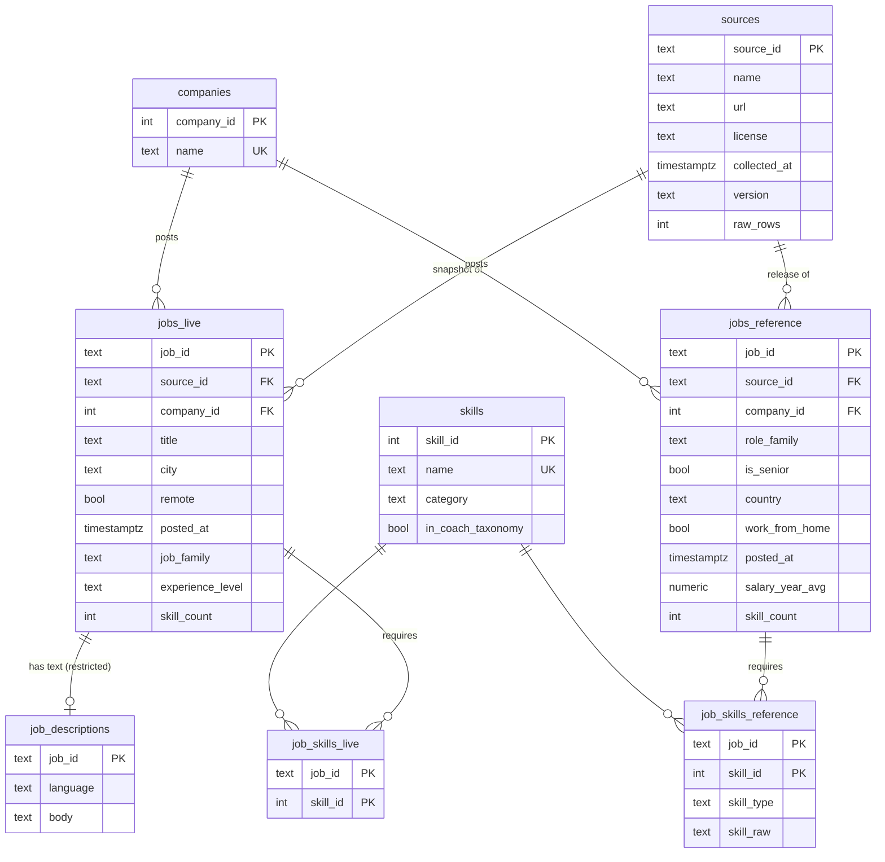

# PostgreSQL: Schema Proposal (Phase 2 preparation, implemented in Phase 3)

Status: **proposal only.** No database has been created yet. The processed CSVs from Phase 2 already have the column layout below, so Phase 3 is a load step, not a re-design.

## Design principles

1. **Two fact tables, one per source.**
   - `jobs_live` holds the Arbeitnow API snapshot. `jobs_reference` holds the 2023 `data_jobs` set.
   - The sources differ in population, time window and skill extraction (see `DATA_PIPELINE.md` §1.1). Separate tables make a pooled `COUNT(*)` across sources impossible by accident.
2. **Shared dimensions.** `skills`, `companies` and `sources` are shared, so a skill means the same thing in both sources and in the interview coach.
3. **Many-to-many skills.** `job_skills_*` link tables have composite primary keys.
4. **Least privilege.**
   - The application and the dashboard export use a read-only role.
   - Free-text descriptions sit in a separate table that this role cannot read.
5. **Parameterised SQL only** in application code. No string-built queries.

## Entity-relationship diagram



## Draft DDL

```sql
CREATE TABLE sources (
    source_id     text PRIMARY KEY,           -- 'arbeitnow', 'data_jobs_2023'
    name          text NOT NULL,
    url           text NOT NULL,
    license       text NOT NULL,
    version       text NOT NULL,              -- snapshot id / dataset commit
    collected_at  timestamptz NOT NULL,
    raw_rows      integer NOT NULL CHECK (raw_rows >= 0)
);

CREATE TABLE companies (
    company_id  serial PRIMARY KEY,
    name        text NOT NULL UNIQUE
);

CREATE TABLE skills (
    skill_id           serial PRIMARY KEY,
    name               text NOT NULL UNIQUE,
    category           text NOT NULL,
    in_coach_taxonomy  boolean NOT NULL
);

CREATE TABLE jobs_live (
    job_id                      text PRIMARY KEY,         -- 'arbeitnow:<slug>'
    source_id                   text NOT NULL REFERENCES sources,
    company_id                  integer REFERENCES companies,
    slug                        text NOT NULL,
    url                         text NOT NULL,            -- attribution / link back
    title                       text NOT NULL,
    city                        text,
    remote                      boolean NOT NULL,
    posted_at                   timestamptz NOT NULL,
    job_family                  text NOT NULL,
    is_tech                     boolean NOT NULL,
    experience_level            text CHECK (experience_level IN
                                 ('student_intern','entry','mid','experienced','lead_manager')),
    experience_level_ambiguous  boolean NOT NULL,
    seniority_from_title        text NOT NULL,
    schedule                    text,
    contract_type               text,
    probable_repost             boolean NOT NULL,
    description_language        text NOT NULL,
    description_chars           integer NOT NULL,
    description_words           integer NOT NULL,
    skill_count                 integer NOT NULL,
    tech_skill_count            integer NOT NULL,
    soft_skill_count            integer NOT NULL,
    programming_language_count  integer NOT NULL,
    cloud_devops_skill_count    integer NOT NULL,
    ai_ml_skill_count           integer NOT NULL,
    data_skill_count            integer NOT NULL,
    requires_english            boolean NOT NULL,
    requires_german             boolean NOT NULL,
    tags                        text[] NOT NULL           -- from the '|'-separated CSV column
);

CREATE TABLE job_descriptions (                           -- restricted: may contain contact details
    job_id    text PRIMARY KEY REFERENCES jobs_live ON DELETE CASCADE,
    language  text NOT NULL,
    body      text NOT NULL
);

CREATE TABLE jobs_reference (
    job_id                text PRIMARY KEY,               -- 'data_jobs:<row>'
    source_id             text NOT NULL REFERENCES sources,
    company_id            integer REFERENCES companies,
    job_title             text,
    job_title_short       text NOT NULL,
    role_family           text NOT NULL,
    is_senior             boolean NOT NULL,
    title_seniority       text NOT NULL,
    job_location          text,
    country               text,
    country_repaired      boolean NOT NULL,
    job_via               text,
    schedule              text NOT NULL,
    work_from_home        boolean NOT NULL,
    no_degree_mention     boolean NOT NULL,
    health_insurance      boolean NOT NULL,
    posted_at             timestamp NOT NULL,
    salary_year_avg       numeric(10,2) CHECK (salary_year_avg > 0),
    skills_missing        boolean NOT NULL,
    skill_count           integer,                        -- NULL = skills not extracted
    programming_skill_count integer, cloud_skill_count integer, libraries_skill_count integer,
    databases_skill_count integer, analyst_tools_skill_count integer, other_skill_count integer
);

CREATE TABLE job_skills_live (
    job_id    text    REFERENCES jobs_live ON DELETE CASCADE,
    skill_id  integer REFERENCES skills,
    PRIMARY KEY (job_id, skill_id)
);

CREATE TABLE job_skills_reference (
    job_id     text    REFERENCES jobs_reference ON DELETE CASCADE,
    skill_id   integer REFERENCES skills,
    skill_type text NOT NULL,
    skill_raw  text NOT NULL,
    PRIMARY KEY (job_id, skill_id)
);

CREATE INDEX ON job_skills_live (skill_id);
CREATE INDEX ON job_skills_reference (skill_id);
CREATE INDEX ON jobs_reference (role_family, is_senior);
CREATE INDEX ON jobs_live (job_family, experience_level);
```

## Roles and security (Phase 3)

| Role | Privileges | Used by |
|---|---|---|
| `coach_owner` | Owns schema: DDL, `COPY` loads | Load scripts only |
| `coach_reader` | `SELECT` on all tables and views **except `job_descriptions`** | FastAPI coach (market context), dashboard exports, notebooks |

- Passwords come from environment variables (`DATABASE_URL` / `.env`) and are never committed.
- Application queries use psycopg parameters (`%s`), never string formatting.

## Loading plan (Phase 3)

| Target | Source file | Notes |
|---|---|---|
| `sources` | `data/raw/*/manifest.json` | Versions, checksums, row counts |
| `companies` | distinct `company_name` from both `jobs` files | Names trimmed; exact-match identity |
| `skills` | `data/processed/skills.csv` | 275 skills |
| `jobs_live`, `job_skills_live` | `data/processed/arbeitnow/*.csv` | `tags` split on `|` into `text[]` |
| `job_descriptions` | `data/processed/arbeitnow/descriptions.csv.gz` | Local only |
| `jobs_reference`, `job_skills_reference` | `data/processed/data_jobs/*.csv.gz` | ~785k / ~3.5M rows via `COPY` |

The load will be idempotent: truncate and reload in one transaction. After loading, row counts will be verified against the Phase 2 reports.

## Planned analytical SQL (Phase 3, `sql/analysis_queries.sql`)

- **Skill demand per role family:** `JOIN` + `GROUP BY` + share of postings.
- **Top-N skills per role:** `RANK() OVER (PARTITION BY role_family ORDER BY postings DESC)`.
- **Skills over-represented among senior roles:** subquery comparing per-skill senior share with the overall senior share.
- **Remote share by job family:** `AVG(remote::int)`.
- **Median salary by role and seniority:** `PERCENTILE_CONT(0.5) WITHIN GROUP (ORDER BY salary_year_avg)` with a `HAVING COUNT(*) >= 30` guard.
- **Views for the Tableau extracts and the coach's market-context lookup.**
