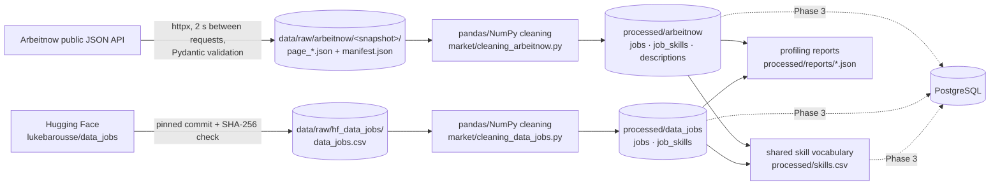

# Data Pipeline (Phase 2): Job Market Intelligence

Every number in this document is produced by the code, not written by hand:
- run `python -m market.pipeline`;
- the figures are read from `data/processed/reports/arbeitnow.json` and `data/processed/reports/data_jobs.json`;
- generated on 2026-10-08.



## 1. Sources

| | **Live source: Arbeitnow API** | **Reference source: `lukebarousse/data_jobs`** |
|---|---|---|
| What | Current job postings from a public job board API (all occupations) | Real 2023 data-job postings collected by Luke Barousse from Google Jobs search results (via SerpApi) |
| Access | `GET https://www.arbeitnow.com/api/job-board-api?page=N` (JSON, no key) | `https://huggingface.co/datasets/lukebarousse/data_jobs` (CSV) |
| Terms / license | Free public API: "please do not abuse", link back to arbeitnow.com, Arbeitnow ToS apply. `robots.txt` allows all paths. Responses advertise `x-ratelimit-limit: 50` | **Apache-2.0** (dataset card) |
| Collected | 2026-10-08 11:21 UTC, snapshot `20261008T112121Z` | Dataset commit `ed776e5a0a8c40ea9d5efbd800772ae52e140f3e`, downloaded 2026-10-08 |
| Method | `python -m market.ingestion.arbeitnow`: pages fetched one at a time, 2 s apart, stopping at the last page; every job validated with a Pydantic schema; raw responses stored unchanged | `python -m market.ingestion.hf_data_jobs`: pinned revision, SHA-256 `635241ed…2436c` verified (231,152,089 bytes) |
| Raw size | 28 pages, **3,180 job records**, 0 schema violations; 21 MB of JSON | **785,741 rows × 17 columns**, 221 MB CSV |
| Time span | Postings created 2026-10-01 10:47 → 2026-10-08 11:02 UTC (one week) | 2023-01-01 → 2023-12-31 |
| Real descriptions | ✅ full HTML descriptions (median 4,007 characters after cleaning) | ❌ no description text; skills were pre-extracted by the author |
| Salary | ❌ none | ✅ annual salary on 21,997 postings (2.8 %) |

### 1.1 Which dataset for what (decision)

**Question:** can the Arbeitnow snapshot alone carry the statistics, ML and dashboard requirements? Measured on the snapshot:

| Need | Arbeitnow alone | Verdict |
|---|---|---|
| Volume | 3,026 unique postings; 828 tech (Data & AI 306, Software & IT 522) | Enough for descriptive statistics and tests on the whole market; thin for technology-specific analyses |
| Seniority labels | Employer-provided experience level on 1,616 postings (53.4 %), 477 of them tech; title-based seniority on 1,372 | Enough for one honest small-sample ML experiment; small for tech-only models |
| Salary | 0 postings | ❌ salary questions impossible |
| Time | One week | ❌ no trends |
| Skills | Extracted from real descriptions with the coach's taxonomy; 2,638 postings with ≥ 1 skill | ✅ consistent with the interview coach |
| Language | 1,721 German, 1,199 English, 106 unknown descriptions | The English-oriented skill taxonomy under-detects soft skills in German text (limitation) |

**Decision:** two sources with **separate roles**, never merged into one table and never compared as a time series.

1. **Arbeitnow snapshot = the live, product-facing dataset.** It satisfies the API/JSON collection requirement, and provides real job descriptions for the interview coach and the "current market snapshot" part of the dashboard. It supports within-source statistics (e.g. remote work vs job family, skill count vs experience level).
2. **`data_jobs` 2023 = the historical reference dataset for scale.** It carries the statistical tests that need large samples or salary (e.g. skill demand by seniority within data roles, salary model) and the main ML model. It is kept outside Git and regenerated from the pinned, checksummed file.

**Why not merge them:**
- the populations differ (all occupations in Germany-centred 2026 postings vs data roles worldwide in 2023);
- the skill extraction differs (our taxonomy on full text vs the author's keyword lists);
- the time windows differ.

A pooled table would mix these differences into every statistic. Example of the trap: SQL is in 57.73 % of `data_jobs` postings but 4.96 % of Arbeitnow postings. That is a population difference (data roles vs all jobs), **not** a decline. The only thing the sources share is the **skill vocabulary** (`processed/skills.csv`), with shares computed within each source.

**Reproducibility trade-off for the API snapshot:** the API only returns current postings, so the snapshot cannot be downloaded again later. The raw pages contain full descriptions; 239 of the 3,028 unique postings contain phone-number-like strings (no email addresses were found). The raw pages and the description text therefore stay **local and git-ignored**. What is committed:
- the manifest (per-page SHA-256 checksums);
- the processed tables **without free text**;
- the reports.

## 2. Raw data storage

```
data/raw/arbeitnow/20261008T112121Z/page_001.json … page_028.json   (git-ignored)
data/raw/arbeitnow/20261008T112121Z/manifest.json                   (committed: checksums, stop reason, counts)
data/raw/hf_data_jobs/data_jobs.csv                                 (git-ignored, 231 MB)
data/raw/hf_data_jobs/manifest.json                                 (committed: revision, SHA-256, license)
```

Raw files are never modified. Every processed value can be recomputed from them.

## 3. Cleaning: Arbeitnow (`market/cleaning_arbeitnow.py`)

| Step | Rows before | Rows after | Removed | Reason |
|---|---|---|---|---|
| Load | 3,180 | 3,180 | 0 | 28 pages |
| Drop exact duplicates | 3,180 | 3,105 | **75** | Identical records returned on two pages: the API orders by newest and new jobs arrived while paginating, shifting the pages |
| Deduplicate by posting id (`slug`) | 3,105 | 3,028 | **77** | Same posting, edited between page requests → keep the most recently fetched version |
| Drop near-empty descriptions | 3,028 | 3,026 | **2** | < 50 characters after HTML removal |

Further cleaning (no rows removed):

| Operation | Detail |
|---|---|
| HTML → text | Block tags become line breaks, entities are unescaped, then the same content-preserving cleaner as the coach (`app/document_processing/cleaner.py`) |
| String normalisation | Titles and company names trimmed and whitespace-collapsed; city = first part of the location, with aliases (`München` → Munich, `Frankfurt am Main` → Frankfurt, `Köln` → Cologne…) |
| Dates | Unix `created_at` → UTC timestamp, date, weekday |
| `job_types` normalisation | The raw field has **93 distinct multilingual values** (76 after lower-casing) ("berufserfahren", "Experienced", "professional / experienced", "Werkstudent"…). They are mapped to controlled vocabularies: `experience_level` (student_intern < entry < mid < experienced < lead_manager), `schedule`, `contract_type`. When a posting lists several levels, the most senior is kept and `experience_level_ambiguous` is set (91 postings) |
| Possible re-posts | Same title + company + city under different ids: **65 flagged, not removed** (may be genuinely separate openings) |

**Missing values after cleaning** (computed). A missing value means "not stated by the employer". It is kept missing and never imputed:

| Column | Missing | % |
|---|---|---|
| `contract_type` | 2,145 | 70.89 |
| `schedule` | 1,483 | 49.01 |
| `experience_level` | 1,410 | 46.60 |
| `city` | 61 | 2.02 |
| all other columns | 0 | 0 |

The raw API records had **no missing fields**: all 10 keys are present on all 3,180 records. The 63 empty location strings become `city = NA`; after deduplication 61 remain.

## 4. Cleaning: `data_jobs` 2023 (`market/cleaning_data_jobs.py`)

| Step | Rows before | Rows after | Removed | Reason |
|---|---|---|---|---|
| Load | 785,741 | 785,741 | 0 | 17 columns |
| Drop exact duplicate rows | 785,741 | 785,640 | **101** | All 17 columns identical |
| Drop duplicate postings | 785,640 | 784,897 | **743** | Same title, company, location and posting timestamp |
| Drop unparseable dates | 784,897 | 784,897 | 0 | All timestamps valid |

Data-quality issues found and handled:

| Issue | Evidence (computed) | Handling |
|---|---|---|
| **Wrong country "Sudan"** | 21,781 raw rows have `job_country = Sudan`. All have `search_location = Sudan`, **none** has a Sudanese location, and 20,865 have US-style or "Anywhere" locations (e.g. "Dallas, TX"). The country came from the scraper's search parameter | `country` is re-derived: 17,629 → United States (US state code / "United States" / state name), 4,146 → unknown; flagged in `country_repaired` (21,775 rows after deduplication) |
| Skills not extracted | `job_skills` missing on 117,037 raw rows (14.9 %) | Kept as **missing, not zero**: `skills_missing = True` and skill counts NaN. Skill shares use the 667,989 postings with skill data as denominator |
| Python-literal lists | `"['sql', 'python']"` strings | Parsed with `ast.literal_eval` (safe literal parsing only) |
| Inconsistent schedule labels | e.g. "Full-time and Part-time" | Primary schedule = first known label; 12,655 → "Unknown" |
| Hourly vs annual salary | `salary_rate` year/hour | Only `salary_year_avg` is used for salary analysis (hourly rates are not comparable without working hours); `log_salary_year` added for modelling |
| Salary outliers | min 15,000, median 115,000, max 960,000 (USD/year as published) | Kept and flagged for robust statistics in Phase 4 (not silently dropped) |

**Missing values after cleaning** (computed, 784,897 rows):

| Column | Missing | % |
|---|---|---|
| `salary_year_avg` / `log_salary_year` | 762,900 | 97.20 |
| `salary_hour_avg` | 774,238 | 98.64 |
| `salary_rate` | 751,839 | 95.79 |
| `skill_count` and the 10 skill-type counts | 116,908 | 14.89 |
| `country` | 4,195 | 0.53 (4,146 repaired-to-unknown + 49 originally missing) |
| `job_location` | 1,045 | 0.13 |
| `company_name` | 18 | 0.00 |
| `job_via` | 8 | 0.00 |
| `job_title` | 1 | 0.00 |

## 5. Engineered features

### Arbeitnow `jobs` (37 columns)

| Feature | Type | How it is computed | Why | Limitation |
|---|---|---|---|---|
| `job_family` | categorical (11) | First matching keyword rule on the title, then the tags (specific families tested first) | Segment the market | Rule-based; 280 postings (9.3 %) fall in "Other" |
| `is_tech` | bool | `job_family` ∈ {Data & AI, Software & IT} | Tech subset (828) | Inherits family errors |
| `experience_level` | ordinal (5) + missing | Mapping of employer `job_types` values | Seniority label provided by the employer (candidate ML target) | 46.6 % not stated |
| `seniority_from_title` | categorical | Regex on the title (senior/lead/principal… vs junior/werkstudent/intern…) | Second, independent seniority signal | Title wording varies by company |
| `schedule`, `contract_type` | categorical | Regex mapping of `job_types` | Employment conditions | Often not stated |
| `remote` | bool | From the API | Remote analysis | Provider's flag; 292 remote postings |
| `description_language` | categorical | Count of English vs German function words (≥ 5 hits) | Stratify text features by language | Heuristic |
| `description_chars`, `description_words` | numeric | Length of cleaned text | Description detail/complexity | Includes company boilerplate |
| `skill_count`, `tech_skill_count`, `soft_skill_count`, `programming_language_count`, `cloud_devops_skill_count`, `ai_ml_skill_count`, `data_skill_count` | numeric | Skills found by the coach taxonomy in title + description, counted by category | Same skill definition as the interview coach | English-oriented taxonomy: under-detection in German text |
| `requires_english`, `requires_german` | bool | Language skill detected | Language requirements matter in Germany | Detects mentions, not proficiency |
| `probable_repost`, `experience_level_ambiguous`, `location_missing` | bool | See cleaning | Transparency flags | n/a |

### `data_jobs` `jobs` (36 columns)

| Feature | Type | How | Why | Limitation |
|---|---|---|---|---|
| `role_family` | categorical (7) | `job_title_short` without "Senior " | Role segmentation / ML target candidate | Label produced by the author's BERT title classifier |
| `is_senior` | bool | `job_title_short` starts with "Senior" | Seniority target (110,654 = 14.1 %) | **Derived from the title**: title words must never be ML features (107,703 of the 110,654 senior labels contain a senior keyword in the title) |
| `title_seniority` | categorical | Regex on raw title | Exploratory comparison | Overlaps with `is_senior` by construction |
| `skill_count` + 10 `<type>_skill_count` | numeric (NaN if unknown) | Lengths of the parsed skill lists per author-defined type (programming, cloud, libraries, databases, analyst_tools…) | Skill-profile features | Keyword extraction by the author |
| `schedule`, `country`, `job_via`, `posted_month` | categorical | Cleaned as above | Segmentation / dashboard filters | Country mix reflects the collector's search locations |
| `has_salary`, `log_salary_year` | bool / numeric | Annual salary present; natural log | Salary analysis on the subset | Only 2.8 % of postings |

### `job_skills` (long tables, many-to-many)

| Source | Rows | Columns |
|---|---|---|
| Arbeitnow | 11,107 (job, skill) pairs | `job_id, skill, skill_category` |
| `data_jobs` | 3,535,853 pairs | `job_id, skill, skill_raw, skill_type, in_coach_taxonomy`. 234 distinct skills; **79.07 % of mentions map onto the coach taxonomy**, the rest keep their source name (e.g. `hadoop`, `oracle`, `sas`, `jira`) |

### Shared vocabulary (`processed/skills.csv`, 275 skills)

One row per skill with its category and its share of postings **within each source** (side-by-side columns, not a pooled population). Phase 8 uses it to show market demand in the interview coach.

## 6. First look at the data (computed, descriptive only)

**Arbeitnow (3,026 postings):**
- **Job families:** Software & IT 522 · Management & Consulting 465 · Sales & BD 338 · Engineering & Technical 323 · Marketing & Communication 313 · Data & AI 306 · Other 280 · Finance & Accounting 244 · Operations & Logistics 98 · HR & Recruiting 91 · Customer Service 46.
- **Experience level:** experienced 912 · student_intern 252 · entry 233 · mid 132 · lead_manager 87 · not stated 1,410.
- **Remote:** 292 (9.65 %).
- **Top cities:** Berlin 613 · Munich 361 · Hamburg 184 · London 82 · Frankfurt 80 · Cologne 80.
- **Most frequent skills** (share of postings): English 62.62 % · Leadership 23.10 % · Teamwork 21.22 % · Communication 20.92 % · Stakeholder Management 18.90 % · German 18.27 % · Social Media 11.80 % · Python 11.47 %.
- **Median skill count by family:** Data & AI 7 · Software & IT 4 · most non-tech families 1–3.

**`data_jobs` 2023 (784,897 postings):**
- **Role families:** Data Engineer 230,532 · Data Analyst 225,068 · Data Scientist 209,055 · Business Analyst 49,015 · Software Engineer 44,835 · ML Engineer 14,070 · Cloud Engineer 12,322.
- **Senior:** 110,654 (14.1 %).
- **Work from home:** 69,507 (8.9 %).
- **Top countries:** United States 223,854 · India 51,031 · United Kingdom 40,355 · France 39,902 · Germany 27,689.
- **Top skills** (share of the 667,989 postings with skill data): SQL 57.73 % · Python 56.96 % · AWS 21.74 % · Spark 19.87 % · Azure 19.82 % · R 19.57 % · Tableau 19.03 % · Excel 19.00 % · Power BI 14.70 % · Java 12.80 %.

These are descriptive counts. Hypothesis tests come in Phase 4 (statistics).

## 7. Reproduce

```bash
pip install -r requirements-dev.txt
python -m market.ingestion.arbeitnow        # new API snapshot (optional: a snapshot is already processed)
python -m market.ingestion.hf_data_jobs     # downloads + verifies the 231 MB reference CSV
python -m market.pipeline                   # ≈ 5 min: cleaning, features, reports, vocabulary
python -m market.pipeline --skip-data-jobs  # ≈ 1.5 min: Arbeitnow only
pytest tests/test_market.py
```

A **new** API snapshot will contain different postings, so its counts will differ from this document. The committed processed tables and reports describe snapshot `20261008T112121Z`.

## 8. Limitations (data)

- Arbeitnow covers one week of postings, is centred on Germany, mixes German and English, and covers all occupations. The skill taxonomy is English-oriented and tech-heavy.
- `data_jobs` covers data roles in 2023 only and was collected from Google Jobs searches, so its country mix follows the collector's search locations. Its labels (`job_title_short`) come from the author's classifier, and its skills from the author's keyword extraction.
- Job families, experience-level mapping and language detection are rule-based. They are documented and tested, but not hand-validated on a labelled sample.
- Neither dataset represents all job seekers or all employers; every finding is phrased as "in this dataset".
